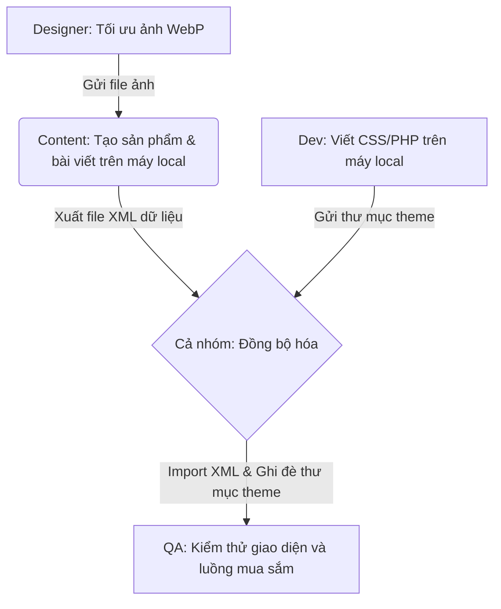

# 📝 Tài Liệu Bàn Giao & Hướng Dẫn Hoàn Thiện Hệ Thống (Takenote)

Tài liệu này tổng hợp toàn bộ các phần việc **đã hoàn thành** và các phần việc **đề xuất tự chỉnh sửa thêm** (như Giỏ hàng, Thanh toán, Chi tiết sản phẩm, Thuộc tính, Trang Blog, Giới thiệu, Liên hệ, Footer) để bạn bàn giao trực tiếp cho **4 thành viên trong đội ngũ**.

> [!IMPORTANT]
> **Môi trường làm việc:** Đội ngũ đang chạy dự án trên môi trường **cục bộ (Local - localhost/XAMPP)** độc lập trên từng máy. Mục **IV** dưới đây hướng dẫn quy trình phối hợp đồng bộ mã nguồn và dữ liệu tối ưu nhất cho nhóm để tránh xung đột và trùng lặp công việc.

---

## Ⅰ. TÓM TẮT CÁC PHẦN ĐÃ HOÀN THÀNH (ĐÃ CHẠY TRÊN WEB)

Các chỉnh sửa kỹ thuật cốt lõi đã được áp dụng trực tiếp vào mã nguồn giao diện của bạn:
1. **Khắc phục sản phẩm không đều:** Sửa lỗi Grid pseudo-elements (lệch trống ô đầu tiên ở hàng 2) trong danh sách sản phẩm. Thẻ sản phẩm đã căn đều chiều cao, tự động căn giữa tên sản phẩm và đẩy nút mua xuống đáy thẳng hàng.
2. **Thiết lập Layout 2 cột trang Danh mục/Cửa hàng:** Cột trái là Sidebar (rộng 280px), cột phải là lưới sản phẩm. Sidebar đã có style premium (Search bar bo tròn, danh mục kèm badge đếm số lượng, bộ lọc giá đồng bộ màu xanh Zen).
3. **Trang chi tiết sản phẩm:** Đã tắt hiệu ứng sticky (chạy bám theo trang) của ảnh sản phẩm để cuộn trang tự nhiên theo yêu cầu. Ô chọn số lượng và nút mua đã căn thẳng hàng ngang cực kỳ đẹp mắt.
4. **Tự động thêm Dropdown Menu:** Đã cập nhật vào Menu chính trên database, tự động xổ ra 4 danh mục trà (*Phụ Kiện Trà, Trà Đặc Sản Khác, Trà Thái Nguyên, Trà Ướp Hoa*) khi di chuột (hover) vào chữ "Sản phẩm" ở Header.

---

## Ⅱ. CHI TIẾT CÁC HẠNG MỤC CẦN HOÀN THIỆN (GIAO CHO TEAM)

Dưới đây là chi tiết kỹ thuật các phần cần chỉnh sửa tiếp theo để bàn giao cho đội ngũ 4 người thực hiện:

### 1. Trang Về Chúng Tôi (About Us)
* **Hướng dẫn nội dung & bố cục:**
  - **Câu chuyện thương hiệu (Storytelling):** Kể về nguồn cảm hứng của Sen Việt Tea (bảo tồn trà cổ thụ, tôn vinh nghệ thuật trà mộc mạc và trà ướp hoa truyền thống).
  - **Triết lý sản phẩm:** 3 giá trị cốt lõi: *Tự nhiên* (không hóa chất), *Thủ công* (sấy và ướp hương bằng tay), *Tinh tế* (trải nghiệm thưởng trà an nhiên).
  - **Hình ảnh minh họa:** Ảnh chụp người nông dân hái trà, nghệ nhân ướp sen bách diệp Hồ Tây, hoặc không gian thưởng trà.

### 2. Trang Kiến Thức Trà (Blog / Tin tức)
* **Các chủ đề bài viết cần biên tập:**
  - **Kiến thức thưởng trà:** Hướng dẫn pha trà chuẩn nhiệt độ và thời gian; chọn ấm trà tử sa.
  - **Lợi ích sức khỏe:** Các bài viết khoa học chứng minh tác dụng của trà (giảm căng thẳng, chống oxy hóa).
  - **Thiết lập kỹ thuật:** Gán trang này làm trang Bài viết trong *Cài đặt -> Đọc* để hệ thống tự động hiển thị danh sách bài viết theo dạng Grid 3 cột đã được lập trình sẵn.

### 3. Trang Liên Hệ (Contact Us)
* **Các thông tin cần chèn:**
  - Thông tin liên lạc (Hotline, email, địa chỉ cửa hàng thực tế, giờ mở cửa).
  - Bản đồ Google Maps nhúng bằng mã iframe trực tiếp vào trang.
  - Form Liên hệ (Dùng plugin như *WPForms* hoặc *Contact Form 7*) để khách hàng gửi yêu cầu hỗ trợ.

### 4. Phần Footer (Chân trang) hoàn thiện hơn
* **Các phần cần bổ sung:**
  - **Thông tin doanh nghiệp:** Tên công ty, mã số thuế, địa chỉ đăng ký kinh doanh dưới chân trang.
  - **Logo Bộ Công Thương:** Chèn logo xanh "Đã thông báo Bộ Công Thương" ở góc dưới bên phải.
  - **Các trang chính sách (Policies Link):** Tạo các trang *Chính sách vận chuyển, Chính sách đổi trả, Chính sách bảo mật* và liên kết chúng dưới chân trang.

### 5. Trang Giỏ hàng & Thanh toán (Cart & Checkout)
* **Trang Giỏ hàng:** Tối ưu bảng danh sách sản phẩm, thu nhỏ ảnh thumb sản phẩm về `80px`, làm nổi bật nút bấm thanh toán.
* **Trang Thanh toán:** Thiết lập layout 2 cột trên máy tính và ẩn các trường thông tin rườm rà tại Việt Nam (Mã bưu điện, Tên công ty, Địa chỉ dòng 2).

---

## Ⅲ. BẢN ĐỒ PHÂN CHIA NHIỆM VỤ CHI TIẾT CHO 4 THÀNH VIÊN

Bạn hãy copy phần này để giao việc trực tiếp cho các thành viên trong nhóm:

### 👤 Thành viên 1: Quản trị nội dung & Sản phẩm (Content / Catalog Manager)
* [ ] Tạo thêm 7 sản phẩm nữa cho đủ **12 sản phẩm demo** (phân bổ đều vào các danh mục trà).
* [ ] Thiết lập thuộc tính **Trọng lượng** (100g, 200g, 500g) và gán biến thể giá cho sản phẩm.
* [ ] Viết nội dung giới thiệu thương hiệu cho trang **Giới thiệu** và đăng 3-5 bài viết vào trang **Kiến thức**.
* [ ] Cấu hình bản đồ, Form liên hệ cho trang **Liên hệ**.
* **Xuất dữ liệu (Export):** Sau khi làm xong trên máy local của mình, vào *Công cụ -> Xuất ra -> Chọn "Tất cả nội dung"* để tải file dữ liệu `.xml` gửi cho các thành viên khác nhập vào máy của họ.

### 👤 Thành viên 2: Lập trình viên Front-End (CSS/JS Developer)
* [ ] Tinh chỉnh bảng giỏ hàng (thu nhỏ ảnh sản phẩm về `80px`) trong [style.css](file:///d:/Develop/xampp/htdocs/wordpress/wp-content/themes/sen-viet-tea/style.css).
* [ ] Bố cục lại trang Thanh toán thành 2 cột cân xứng và ẩn các trường nhập thông tin thừa.
* [ ] Bổ sung thông tin doanh nghiệp, mã số thuế và chèn logo Bộ Công Thương vào file [footer.php](file:///d:/Develop/xampp/htdocs/wordpress/wp-content/themes/sen-viet-tea/footer.php).
* **Đồng bộ Code:** Là người duy nhất chỉnh sửa file mã nguồn trong thư mục theme. Khi sửa xong cần nén thư mục theme gửi cho cả nhóm ghi đè (hoặc push lên Git).

### 👤 Thành viên 3: Thiết kế đồ họa & Giao diện (UI/UX Graphic Designer)
* [ ] Rà soát lại tất cả ảnh đại diện sản phẩm (đảm bảo hiển thị đẹp mắt theo tỷ lệ vuông 1:1).
* [ ] Thiết kế banner và hình ảnh minh họa cho các bài viết trên trang *Kiến thức* và trang *Giới thiệu*.
* [ ] Nén tối ưu dung lượng ảnh (định dạng WebP, dung lượng < 150KB) trước khi gửi cho Thành viên 1 tải lên.

### 👤 Thành viên 4: Kiểm thử chất lượng & Tối ưu chuyển đổi (QA / CRO Tester)
* [ ] Kiểm tra thử nghiệm luồng mua hàng trọn gói (Thêm giỏ hàng -> Thanh toán -> Đặt hàng).
* [ ] Test hiển thị menu hover "Sản phẩm" xem menu con có xổ xuống mượt mà trên các kích thước màn hình.
* [ ] Kiểm tra hiển thị chân trang (Footer) và liên kết các trang chính sách xem có bị lỗi font hay lệch bố cục không.

---

## Ⅳ. QUY TRÌNH PHỐI HỢP TRÊN MÔI TRƯỜNG LOCAL (LOCAL WORKFLOW)

Vì cả 4 thành viên đều chạy độc lập trên máy cá nhân (XAMPP / Localhost), nhóm cần tuân thủ quy trình sau để tránh xung đột mã nguồn và mất mát dữ liệu:

### 1. Đồng bộ hóa mã nguồn (CSS, PHP)
- **Thành viên 2 (Dev)** sẽ giữ quyền sửa đổi code chính trong thư mục theme `wp-content/themes/sen-viet-tea/`.
- Khi có cập nhật code mới, Thành viên 2 sẽ gửi thư mục theme này cho cả nhóm (hoặc sử dụng Git/GitHub). Các thành viên khác chỉ cần tải về và ghi đè vào thư mục theme tương ứng trên máy mình là giao diện sẽ tự động cập nhật.

### 2. Đồng bộ hóa dữ liệu (Sản phẩm, Bài viết, Menu)
- Để tránh việc 4 người phải tự tay tạo lại từng sản phẩm và bài viết trên máy của mình, **Thành viên 1 (Content)** sẽ chịu trách nhiệm nhập dữ liệu gốc.
- Sau khi nhập xong sản phẩm, thuộc tính và viết bài trên máy mình, Thành viên 1 vào **Công cụ (Tools) -> Xuất ra (Export)** -> chọn xuất **Tất cả nội dung** để tải về 1 file `.xml`.
- Thành viên 1 gửi file `.xml` này cho 3 thành viên còn lại. Mọi người chỉ cần vào **Công cụ (Tools) -> Nhập vào (Import) -> Chạy trình nhập WordPress** trên máy mình để tải file lên. Toàn bộ sản phẩm, bài viết và menu sẽ tự động được tạo giống hệt máy của Thành viên 1!

### 3. Đồng bộ hóa thư viện hình ảnh (Media)
- File dữ liệu `.xml` chỉ chứa thông tin chữ và liên kết ảnh. Để ảnh hiển thị đầy đủ, Thành viên 1 cần nén thư mục chứa ảnh tải lên: `wp-content/uploads/` và chia sẻ cho cả nhóm.
- Các thành viên khác tải về, giải nén và ghi đè vào thư mục `wp-content/uploads/` trên máy local của mình là ảnh sẽ hiển thị đầy đủ, sắc nét.
